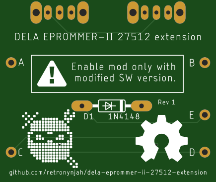
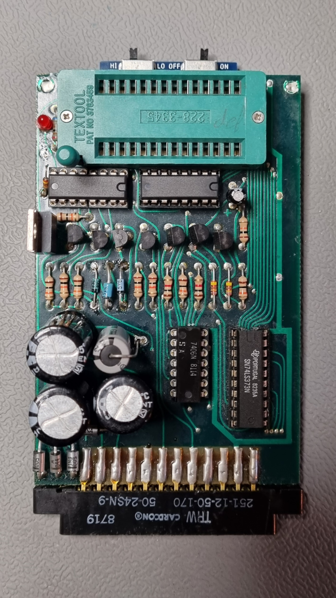
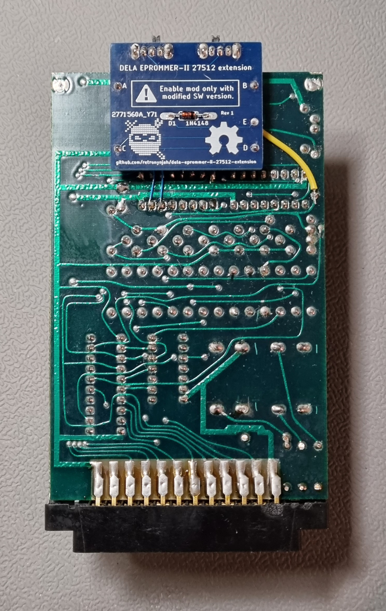
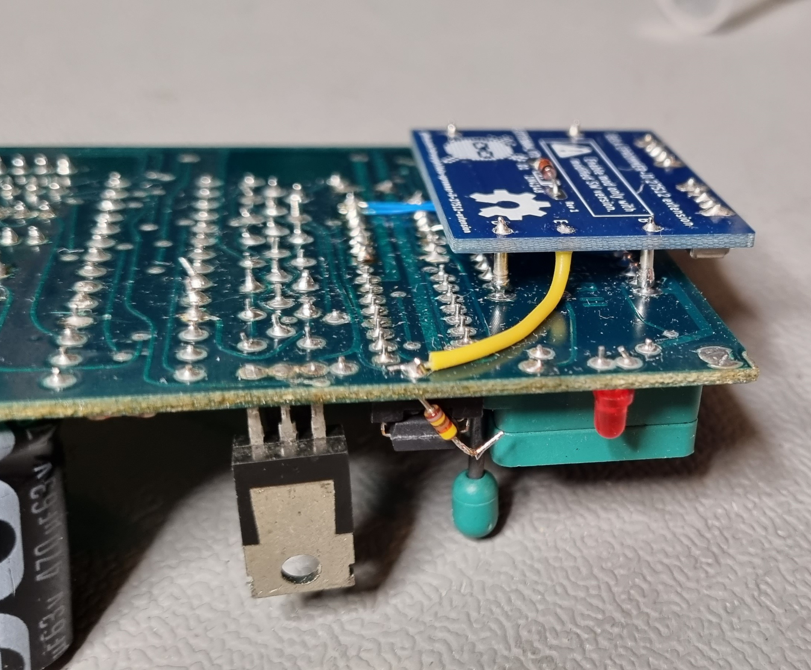

# DELA-EPROMMER-II 27512 Extension

## Background 
This is a reproduction of the 27512 extension board from DELA-Elektronik for the DELA-EPROMMER II for the Commodore 64.  
The user instruction calls this add-on "Umbauset für den DELA-EPROMMER II"

This extension makes it possible to program 27512 EPROMS with the DELA-EPROMMER II by removing VPP from pin 1 and replacing it with the switch controlled address pin A15. A special version of the DELA EPROMMER software is needed which connects VPP to pin 22. This special version is available in the software folder.
The 27512 has to be programmed in two 32kB passes and there are two switches on the board, one for activation/deactivation of the extension and one for 32kB block selection (A15).

When this extension is active, the EPROMMER should only be used with a special version of the DELA EPROMMER software. If the extension is deactivated by the switch, it can be used with the standard software.
A scan of the orginal German user manual for the extension was posted in [this forum thread](https://www.forum64.de/index.php?thread/109845-dela-ii-brenner-mit-zusatzplatine/). There's also a copy in the docs folder.

## Installation instruction
Follow the german user instruction in the docs folder or:

* Remove the diode that is located close to the ZIF socket and the LED. That diode is called D1 on Dirk's reproduction PCB.
* Solder points A,B,C,D on the extensions to the four corner pins of the ZIF socket on the bottom side of the board.
* Wire point E on the extension board to where the anode side of the diode was connected. See photos below or the original instruction in the docs folder.

The part count fort this build is low.
The two slide switches in the design are different from the ones on the original extension because silde switches with that pitch can't be found anymore.  
The ones I used are right-angle switches with a 2mm pitch and has solder connections for the metal frame to add stability. I used a cheap TE switch with part number 1825232-1 which can be found at Digikey with part number A107673-ND.  
The diode is a 1N4148.  
The posts that I use to connect the extension to the pins on bottom of the ZIF-socket are four pins that I pulled out of an IC socket with machined (round) pins. They can usually be grabbed with pliers and pushed out of the socket.

## Usage
**Warning!** Activate the exetension only together with the modified software.

The EPROM has to be programmed in two halved because a full 64kB EPROM image can't fit in RAM so you need to split your ROM file in two halves before programming.

To burn a 27512 EPROM:
* Activate the extension by setting the right switch to the ON position.
* Fire up the custom 512kbit version of the EPROMMER-II application
* Insert EPROM to be programmed.
* Load one half of the 64KByte ROM you want to program.
* Use the left slide switch to select which half you want to program
* Go into the EPROM programming menu and program as usual but select the invisible 6th option (27512) when selecting EPROM type.
* Repeat procedure for the next half of the EPROM

Dirk Wouters has created a reproduction of the complete DELA-EPROMMER II which together with schematics, user manuals and standard software can be found at https://github.com/DL2DW/DELA-EPROMMER-II
