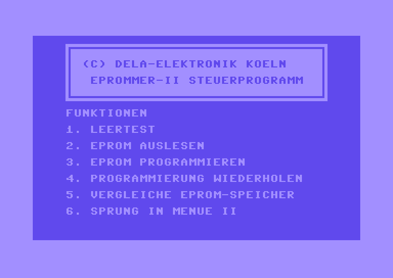

# Software

This directory contains the original German version of the special 512kbit version of the EPROMMER software.

It also contains an archive with English versions translated by [giobbino](https://github.com/giobbino). Thank you!
The archive contains English translations of both the standard version of the software and the 512kbit version as well as translated user instructions. Everyone is welcome to improve the translations.

The English software along with some other tools now has an own repository at https://github.com/giobbino/DELA-Eprommer-II-ENG-software-for-Commodore-64
